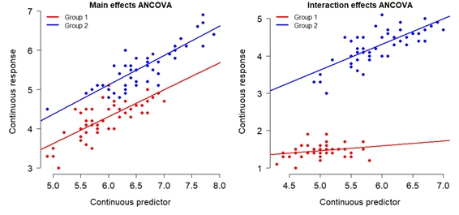

# Overview

This document is an overview for some statistical methods commonly used
in parasitology (and biology in general). It is not meant to be a
statistical textbook, just a primer to get you up and running with your
own analysis. For this tutorial, you will need a computer with a recent
version of [R and RStudio
installed](https://posit.co/products/open-source/rstudio). If you cannot
install RStudio, perhaps because you have a Chromebook, you can use the
Posit [RStudio Cloud
edition](https://posit.co/products/enterprise/cloud) (requires free
account signup).

::: callout-tip
Install R *before* installing RStudio. The download links at the link
above should take care of this for you.
:::

# Why do we have to do statistics?

Science works by testing **hypotheses**, or proposed explanations for
natural phenomena, against data. At some point, a scientist must
determine whether the data they have collected **support** or **do not
support** their hypothesis. Support or non-support manifest as the data
either matching the predictions of a hypothesis, or not matching the
predictions of a hypothesis. The **predictions** of a hypothesis are
patterns that would be expected in the data if the hypothesis were true.
In science, we require that any hypothesis be **falsifiable**, at least
in principle. This means that there must be some observation that would
prove a hypothesis false. That is, a false hypothesis must make at least
some false predictions. A true hypothesis, by contrast, should generate
*only* true predictions.

The trouble is, biological data are noisy. Individual organisms differ
from one another, measurements are imperfect, and random chance
influences every sample we collect. As a result, patterns can appear in
a dataset even when no real biological effect exists. Our goal is to
distinguish true biological **signals** from background **noise**.

Statistical tests help us do this. They ask whether the pattern we
observed is stronger than we would expect to see from random variation
alone. If the observed pattern would be very unlikely to arise from
noise by itself, we have evidence that a real signal may be present.
This evidence is summarized by the *p*-value, which estimates how
surprising our data would be if there were actually no biological
effect. Smaller *p*-values suggest a stronger signal relative to the
background noise, while larger *p*-values suggest that the observed
pattern could easily be explained by random variation. Patterns that are
stronger than what would be expected by chance are called
**statistically significant**. For historical (and somewhat arbitrary
and controversial reasons), biologists usually use $p<0.05$ as the threshold for significance.

# Types of tests

There are thousands of statistical tests out there, but most biologists
only ever need a handful. One of the hardest parts of "doing statistics"
for many people is choosing which test to use. If you ask a
statistician, they are going to ask you, "Well, what *question* are you
trying to answer?". This is because every statistical test answers a
particular question:

-   Do groups A and B have the same mean?

-   As variable $x$ changes, does variable $y$ also tend to change?

-   If variable $x$ changes by this much, how much will $y$ change?

-   If event $G$ happens, how likely is it that event $H$ also happens?

-   Do values in group $A$ tend to be greater than, or smaller than,
    values in group $B$?

-   Are there categories that consistently and reliably capture the
    variation in these sample units?

Notice that all of the statements above are statistical statements, not
necessarily biological statements. Translating biological ideas and
questions into statistical statements and questions is one of the
hardest parts of doing statistics.

The hypotheses that we test in biology tend to fall into just a few
categories:

1.  Testing for a difference in **mean** or **location** between groups. If you have 2 groups, use a *t*-test. If you have 3 or more groups, use analysis of variance (ANOVA).

2.  Testing for a **continuous relationship** between a **response variable** (or multiple variables) and one or more **predictor variables**. Also referred to as predicting or **modeling** a continuous variable. You can try correlation if you don't care about the relationship, or linear regression or ANCOVA if you do.

3.  Testing for (lack of) **independence between categories** of observations. You probably want a $\chi^2$ test ("chi-squared"). 

4.  **Classifying** observations based on predictor variables. For binary classification, start with logistic regression. For $>2$ categories, try CART.

These categories are not mutually exclusive...some questions can be analyzed in $>1$ way!

# Summary statistics

## Summarizing data in R

The most common summary statistics have eponymous functions in R: `mean()`, `sd()`, `var()`, `IQR()`, `quantile()`, and so on. 

```{r}
#| collapse: true

# get some random values
# with mu = 0 and sigma = 1
# (standard normal distribution)
z <- rnorm(100)
```

```{r}
# mean
mean(z)
```

```{r}
# sd (==sqrt(var))
sd(z)
```

```{r}
# variance (==sd^2)
var(z)
```

```{r}
# quantiles 
## 20th percentile: 20% of values are <= this value
quantile(z, 0.2)
```

```{r}
## 90th percentile: 90% of values are <= this value
quantile(z, 0.9)
```

```{r}
# median
median(z)
```

```{r}
# also the median
quantile(z, 0.5)
```

```{r}
# IQR
IQR(z)
```

When summarizing values, we typically write $\bar{x}\pm s$. 

:::{.callout-tip}
**Missing values**

When a dataset contains missing values, `NA`, you need to tell the summarizing function to ignore them. Usually we add the argument `na.rm=TRUE`. For example, `mean(x, na.rm=TRUE)`.
:::

## Summarizing by groups in R

To summarize data by group in R, use the function `aggregate()`. For this example, we will use the built-in *iris* dataset, [which contains measurements taken from 150 flowers of 3 different species of *Iris*](https://en.wikipedia.org/wiki/Iris_flower_data_set). 

We can use `aggregate()` to make a table with the mean and SD of the petal length of each species in `iris`.

```{r}
# calculate mean of each species
ag.petal <- aggregate(Petal.Length~Species, data=iris, mean)

# calculate sd of each species
ag.petal$SD <- aggregate(Petal.Length~Species, data=iris, sd)$Petal.Length
ag.petal
```

The R function `aggregate()` does what Pivot Tables do in Excel: summarize by groups. However, R has a huge advantage over Excel in that it can summarize by any function you can define, as opposed to the short list of functions available in Excel. For example, you could count the number of values >= 3 or between arbitrary values like 3.5 and 4.7. A function defined and used within a function as shown below is called an **anonymous function**. 

```{r}
# count number of values >=3 with an anonymous function
ag3 <- aggregate(Petal.Length~Species, data=iris, 
                 function(x){length(which(x>=4))})
ag3
```

Here is an example where we count the number of missing values in a variable...a very useful function for figuring out why your code doesn't work!

```{r}
aggregate(Petal.Length~Species, data=iris, 
          function(z){any(is.na(z))})
```

# Tests comparing groups

In a test for difference in mean or location, we are interested in
whether observations differ between groups. Most of the time we are testing whether the central tendency differs between groups. A test of this kind evaluates a prediction like, "a typical value in group A is different from a typical value in group B".

Alternatively, we can test for a difference in **location**: the
relative position of random values from 2 or more groups. This is a
slightly different statement: "values in group A tend to be greater than
(or less than) values in group B". Put another way: "If we pick a random
value from group A, it will be reliably greater (or less than) than a
random value from group B". Tests for location are performed on the **rank order** of the values, not the values themselves.

When comparing groups, the data are usually best shown using a
**boxplot**, also known as a **box-and-whiskers** plot. The exact
implementation varies between software packages, but boxplots usually
show the median, interquartile range (approximately), extreme values,
and possible outliers (if any) Run the command `?boxplot.stats` to see a description of how boxplots are calculated in R. 

## Comparing 2 groups: the *t*-test

The ***t*-test** compares the means of two groups. There are many kinds of *t*-tests, but the case of comparing two means is the most common. Technically, this is called a **"two-sided, two-sample *t*-test** or sometimes a **Student's *t*-test**, although the latter term is not accurate because modern software uses a different method of accounting for unequal variances between groups (the "Welch-Satterthwaite correction"). Most of the time you can just say *t*-test and people will know what you mean.

***t*-test example**

Here is an example of running a *t*-test on two samples. If you try the code yourself with a different random number seed (`set.seed()`), or without a random number seed, your numbers will be slightly different because of the random number generation.

```{r}
# make some data
set.seed(123) # ensures same numbers each time RNG is done
x1 <- rnorm(n=20, mean=10, sd=4)
x2 <- rnorm(n=20, mean=15, sd=4)

# run the test
t.test(x1, x2)
```

You can also use a *t*-test on data within a data frame using the formula interface. Notice that this code is essentially the same as the code for `boxplot()` and `aggregate()`.

```{r}
# grab 2 of the species in iris
use.species <- c("versicolor", "virginica")
iris.2spp <- iris[which(iris$Species %in% use.species),]

# remove the now-missing level of "setosa"
# (this will matter for the plot in the next code block)
iris.2spp$Species <- droplevels(iris.2spp$Species)

# run the t-test
t.test(Petal.Length~Species, data=iris.2spp)
```

Show the difference using a boxplot:

```{r}
#| fig-cap: "Boxplot showing that petal length is greater in *Iris virginica* than in *Iris versicolor*."
#| fig-alt:  "Boxplot showing that petal length is greater in Iris virginica than in Iris versicolor."
#| label: fig-ttestboxplot
#| 
boxplot(Petal.Length~Species, data=iris.2spp,
        xlab="Species", ylab="Petal length (cm)")
```

## Comparing 3 or more groups: ANOVA

### One-way ANOVA

When there are 3 or more groups, we do not use a *t*-test and instead use **analysis of variance**, or **ANOVA**.

When there is only 1 explanatory **factor** (grouping variable), regardless of how many **levels** (groups) it has, the test is called a **one-way ANOVA**.


```{r}
mod1 <- aov(Petal.Length~Species, data=iris)
summary(mod1)
```

The `summary()` command produces the **ANOVA table**, which summarizes how the variance is partitioned between different sources. In this case, the total sum of squared deviations of all observations is $437.1 + 27.2=464.3$. ANOVA partitions that into variation due to species (437.1) and residual or "left over" variation (27.2). We sometimes think of the 437.1 as "between group" variation, and the 27.2 as "within group" variation. If there is a significant effect of species, then roughly speaking there should be more between group variation than within group variation. Really it is the variation per degree of freedom (`Df`) that defines that ratio, or $F$ statistic. Because of the way the table rounds values, it obscures the fact that $F=MS_{between}/MS_{residuals}$, or the ratio of the mean between group sums of squares and the mean within group sums of squares. The values shown, 281.55 and 0.19, are rounded so much that their quotient doesn't equal the printed F value.

:::{.callout-tip}
**Rounding errors**

R is somewhat idiosyncratic in choosing how many digits it prints, and this can lead to confusion if values are rounded to too few decimal places. In the ANOVA example above, the MSE for the two sources of variation should divide to the F statistic. However, $218.55/0.19\neq1180$. If you look at the raw output of `mod1`, however, you that the sums of squares for Species and Residuals are 437.1028 and 27.2226, respectively. With more decimal places, you can then recalculate $\left(437.1028/2\right)/\left(27.2226/147\right)=1180.161$, the correct $F$ ratio.
:::

The **omnibus test** above shows that at least 1 level, or group, of `Species` differs from one of the others. To see the tests for the pairwise differences, we have to run a **post-hoc test**. One of the most common post-hoc tests for ANOVA is Tukey's Honest Significant Difference (HSD) test:

```{r}
TukeyHSD(mod1)
```

The Tukey output shows us that every group differs from every other, with *p<0.001* (here *p* is rounded to 0, although it can never be 0). The differences in group means are presented with their **95% confidence intervals (CI)**. For example, the difference between the group means of versicolor and setosa is 2.798 cm, with 95% CI = [2.594, 3.002]. Notice that none of these CI include 0: this suggests that a true difference of 0 between any two groups is very unlikely. Even without examining *p*-values, CI provide a useful way to evaluate both the direction and magnitude of differences.

One of the nice things about the Tukey HSD test is that the *p*-values are automatically adjusted for **multiple comparisons**, a phenomenon where the probability of a false positive goes up as a [researcher performs more tests](https://xkcd.com/882/), using a customized version of the probability distribution for the test statistic. This controls the **family wise error rate**, or total false positive probability for this set of three related tests. 

### Two-way ANOVA (and more ways)

When there are 2 or more explanatory factors, the test is called a **two-way ANOVA**, or **three-way ANOVA**, and so on. We can add additional factors to an ANOVA with the `+` sign.

```{r}
# make a copy of iris with an extra grouping variable
iris2 <- iris
iris2$Flower <- c("purple", "pink")

# fit the two-way ANOVA without interaction
mod2 <- aov(Petal.Length~Species+Flower, data=iris2)
summary(mod2)
```

Adding the colors that way just repeated them until the column was full: purple, pink, purple, pink, and so on until the new vector had length 150 (the number of rows in `iris`). This essentially distributes the colors randomly with respect to the species and thus the petal lengths, so it should be no surprise that flower color had no effect on petal length ($p=0.61$). A Tukey test confirms the effects of species, and the non-effect of `Flower`. Technically, you don't need to do or report a Tukey test if the main effect is nonsignificant.

```{r}
TukeyHSD(mod2, which="Species")
```

## Interactions: one variable affects another

Something we could also ask is whether there was an **interaction** between species and color: a situation where one variable changes the effect of another. Maybe purple an pink flowers really do have different petal lengths, but only in one species. Testing for an interaction would help detect that kind of pattern. To test for an interaction between two variables, use the `*` symbol instead of the `+`.

```{r}
# fit the two-way ANOVA WITH interaction
mod3 <- aov(Petal.Length~Species*Flower, data=iris2)
summary(mod3)
```

The interaction is nonsignificant, so we should instead report the main effects in the model without the interaction (`mod2`). If there is an interaction present, then it becomes impossible to discuss the effects of one variable without discussing the effects of the other. We will explore interactions more in the section on ANCOVA below.


# Correlation

**Correlation** is a statistical relationship where changes in one variable are reliably associated with changes in another variable. This relationship need not be causal, hence the famous mantra, “correlation does not equal causation”. As such, correlation is usually a **descriptive technique**, which lets researchers characterize patterns, rather than an **inferential technique**, which lets researchers make estimates about unknown parameters (i.e., infer unobserved quantities). 

Correlations are typically expressed as a **correlation coefficient**, a value that indicates the strength of the correlation by its magnitude and the direction of the correlation by its sign.

- **Positive correlation:** as one variable gets larger, the other variable does too. Correlation coefficient approaches $+1$.

- **Negative correlation:** as one variable gets larger, the other variable gets smaller. Correlation coefficient approaches $-1$.

When a correlation coefficient is near 0, this indicates no correlation.

```{r}
#| echo: false
#| fig-width: 9
#| fig-height: 6
#| fig-cap: "Illustration of possible positive and negative relationships between pairs of variables, with different levels of consistency (*r*)."
#| fig-alt:  "Illustration of possible positive and negative relationships between pairs of variables, with different levels of consistency (r)."
#| label: fig-correlations

set.seed(777)

ad <- function(x){
  res <- x + ifelse(any(x<0), abs(min(x)), 0)
  res <- res/max(res)
  return(res)
}

n <- 24
x <- runif(n, 0, 10)
y1 <- 1 + 2.3 * x + rnorm(n, 0, 3)
y1 <- ad(y1)
y2 <- 1 + 2.3 * x + rnorm(n, 0, 16)
y2 <- ad(y2)
y3 <- 1 + 2.3 * x + rnorm(n, 0, 64)
y3 <- ad(y3)

y4 <- 20 - 2.8 * x + rnorm(n, 0, 6)
y4 <- ad(y4)

y5 <- 20 - 2.8 * x + rnorm(n, 0, 15.5)
y5 <- ad(y5)

y6 <- runif(n)

par(mfrow=c(2,3), mar=c(5.1, 5.1, 1.1, 1.1), bty="n",
    lend=1, las=1, cex.axis=1.3, cex.lab=1.3,
    mgp=c(1.5, 1, 0))
plot(x, y1, xlab="One variable", ylab="Another variable", yaxt="n", xaxt="n")
text(0, 0.9, expression(italic(r)==0.8), adj=0, cex=1.4)
title(main="Strong positive correlation", adj=0)
axis(side=1, at=c(0, 10), labels=NA)
axis(side=2, at=c(0, 1), labels=NA)

plot(x, y2, xlab="One variable", ylab="Another variable", yaxt="n", xaxt="n")
text(0, 0.9, expression(italic(r)==0.5), adj=0, cex=1.4)
title(main="Weak positive correlation", adj=0)
axis(side=1, at=c(0, 10), labels=NA)
axis(side=2, at=c(0, 1), labels=NA)

plot(x, y3, xlab="One variable", ylab="Another variable", yaxt="n", xaxt="n")
text(0, 0.9, expression(italic(r)=="0.0"), adj=0, cex=1.4)
title(main="No correlation", adj=0)
axis(side=1, at=c(0, 10), labels=NA)
axis(side=2, at=c(0, 1), labels=NA)

plot(x, y4, xlab="One variable", ylab="Another variable", yaxt="n", xaxt="n")
text(10, 0.9, expression(italic(r)==-0.8), adj=1, cex=1.4)
title(main="Strong negative correlation", adj=0)
axis(side=1, at=c(0, 10), labels=NA)
axis(side=2, at=c(0, 1), labels=NA)

plot(x, y5, xlab="One variable", ylab="Another variable", yaxt="n", xaxt="n")
text(10, 0.9, expression(italic(r)==-0.5), adj=1, cex=1.4)
title(main="Weak negative correlation", adj=0)
axis(side=1, at=c(0, 10), labels=NA)
axis(side=2, at=c(0, 1), labels=NA)

plot(x, y6, xlab="One variable", ylab="Another variable", yaxt="n", xaxt="n")
text(10, 0.9, expression(italic(r)=="0.0"), adj=1, cex=1.4)
title(main="No correlation", adj=0)
axis(side=1, at=c(0, 10), labels=NA)
axis(side=2, at=c(0, 1), labels=NA)
```

## Linear correlation

When we suspect that two variables are correlated, and that the shape of that relationship is a straight line, we can use **Pearson's product moment correlation**, also called **Pearson's *r***. 

```{r}
# calculate linear correlation coefficient
cor(iris$Petal.Length, iris$Petal.Width)
```

You can also request a significance test on the coefficient, although some might consider this unnecessary because correlation is inherently a descriptive technique. If you are using correlation as a hypothesis test, however, you do need a *p*-value.

```{r}
cor.test(iris$Petal.Length, iris$Petal.Width)
```

## Scatterplots

The best way to illustrate a possible correlation between two numeric variables is in a **scatterplot**. Typically we put the **response** or **dependent** variable on the vertical (Y) axis, and the **predictor** or **dependent** variable on the horizontal (X) axis. However, in a correlation test neither variable is assumed to cause the other, so you can plot variables as you please.

The `R` syntax for scatterplots is simple. The `plot()` command builds most kinds of plots. The first argument contains the $x$ values, and the second argument the $y$ values. Other arguments like `xlab` and `ylim` follow, to set graphical labels, limits, and other parameters. Many experienced users also preface their `plot()` command with `par()`, which gives global control over many graphical options.

Below is an example workflow for making a good scatterplot. Notice that we put information about symbology (point style and color) in the data frame containing the data, and call those with `plot()`. 

```{r}
#| fig-cap: "Example scatterplot using variables from iris, axis titles, symbology, and a legend."
#| fig-alt:  "Example scatterplot using variables from iris, axis titles, symbology, and a legend."
#| label: fig-scatterplot1

# spare copy to work on
dx <- iris

# assign colors
iris.species <- sort(unique(dx$Species))
use.colors <- c("red", "blue", "green")
names(use.colors) <- iris.species
dx$color <- use.colors[dx$Species]

# assign symbols
use.symbols <- 15:17
names(use.symbols)
dx$symbol <- use.symbols[dx$Species]

# use par to set some nice options
par(
  mar=c(5.1, 5.1, 1.1, 1.1), # better margins
  bty="n",                   # remove outer box
  las=1)                     # number orientation
plot(dx$Petal.Length, dx$Petal.Width,
     xlab="Petal length (cm)",
     ylab="Petal width (cm)",
     pch=dx$symbol, col=dx$color,
     ylim=c(0, 3))
legend("topleft", legend=iris.species,
       pch=use.symbols, col=use.colors,
       bty="n")

```

## Nonlinear correlation

Many processes and relationships in biology are not linear, and sometimes we want to calculate correlation coefficients for those relationships. Consider the figure below. The left panel clearly shows some relationship between $X$ and $Y$, but it is not linear and using a linear correlation coefficient might miss something.

```{r}
#| echo: FALSE
#| fig.width: 8
#| fig.height: 4
#| fig-cap: "Left: illustration of a nonlinear correlation. Right: When values are rank-transformed, the nonlinear trend becomes linear."
#| fig-alt:  "Left: illustration of a nonlinear correlation. Right: When values are rank-transformed, the nonlinear trend becomes linear."
#| label: fig-nonlinear

set.seed(123)
n <- 50
x <- runif(n, 0, 5)

y1 <- 1 + x*2.1 + rnorm(n, 0, 1)
y2 <- (13*x)/(1.5+x)+rnorm(n, 0, 1)
y2 <- plogis(y1-6)

par(mfrow=c(1,2), mar=c(4.1, 4.1, 1.1, 1.1),
    lend=1, las=1, bty="n", cex.lab=1.4, mgp=c(2, 1, 0))

plot(x, y2, xlim=c(0, 5), xaxt="n", yaxt="n",
    xlab="X", ylab="Y")
seqx <- seq(min(x), max(x), length=100)
points(seqx, plogis(2.1*seqx-5), type="l", lwd=3, col="red")
axis(side=1, at=c(0, 5), labels=NA)
axis(side=2, at=c(0, 1), labels=NA)
title(main="Nonlinear pattern", adj=0)

plot(rank(x), rank(y2), xaxt="n",
    xlab="rank(X)", ylab="rank(Y)", yaxt="n")
axis(side=1, at=c(0, 50), labels=NA)
axis(side=2, at=c(0, 50), labels=NA)
segments(0, 0, 50, 50, lwd=3, col="red")
title(main="Rank-transformed", adj=0)

```

However, if you **rank-transform** the data, the relationship turns into something more linear. A “rank-transform” assigns the smallest value value 0, the second smallest value to 1, and so on. Rank-transforming these data lets us calculate a nonparametric, nonlinear correlation. The nonparametric equivalent of Pearson’s *r* is **Spearman’s $\rho$** ("rho"). It can be obtained using code similar to that for linear correlation.

```{r}
# just the correlation
cor(iris$Petal.Length, iris$Sepal.Width, method="spearman")
```

```{r} 
# significance test
cor.test(iris$Petal.Length, iris$Sepal.Width, method="spearman")
```

When you run a nonlinear correlation test, you will often get the warning `Warning in cor.test.default ... : Cannot compute exact p-value with ties`. All this means is that some of the rankings are tied. This warning can be safely ignored.

# Linear regression

Linear models describe relationships where a change in some response variable $Y$ is described by a unit change in a predictor $X$ multiplied by a constant called the **slope**. In other words, if $X$ increases by 1, then $Y$ increases by the slope. This change in $Y$ per unit change in $X$ is the same for all $X$, so a graph of the model is a straight line. This is why linear models are *called* linear models. The most important are the *t*-test and ANOVA (which we already covered), and linear regression and analysis of covariance (ANCOVA).

## Lots of analyses are linear models in disguise

Many models that people fit to data, including some that appear nonlinear, are actually linear models in disguise. This is because transforming one or both of $X$ and $Y$ can "straighten out" a nonlinear curve into a linear one.

### Ordinary linear models

The basic linear regression model is written as

$$y=\beta_0+\beta_1x$$

and is the same as the equation for a line that you learned in algebra: $y=mx+b$. Statisticians just use $\beta_0$ for the $Y$-intercept and $\beta_1$ for the slope instead of $b$ and $m$.

**Why it's linear:** Rate of change $dy/dx$ is a scalar ($\beta_1$) and constant for all $X$.

### Polynomials

A polynomial is a function such as $Y=\beta_0+\beta_1X+\beta_2X^2+...+\beta_kX^k$, where $k$ is the **order** of the polynomial. A polynomial of order 2 is a quadratic equation. A polynomial of order 3 is a cubic, and so on. Polynomials have well-known shapes, such as the parabola of the quadratic function.

```{r}
#| echo: false
#| fig.width: 9
#| fig.height: 3
#| fig-cap: "Curve shapes produced by polynomial equations of order 1, 2, and 3: linear, quadratic, and cubic, respectively."
#| fig-alt:  "Curve shapes produced by polynomial equations of order 1, 2, and 3: linear, quadratic, and cubic, respectively."
#| label: fig-polynomials1


x1 <- seq(-4, 4, length=100)
y1 <- 1 + 0.8*x1

x2 <- x1
y2 <- -1 + 0.5*x2^2
x3 <- seq(-6, 5, length=100)
y3 <- (0.25*x3^3) + (0.75*x3^2) -0.66*x3 -2

par(mfrow=c(1,3), mar=c(5.1, 5.1, 1.1, 1.1), cex.lab=1.3, cex.axis=1.3,
    bty="n", lend=1, las=1)
plot(x1, y1, type="l", lwd=3, xaxt="n", yaxt="n", xlab="X", ylab="Y")
axis(side=1, at=c(-4, 4), labels=NA)
axis(side=2, at=c(-2,4), labels=NA)
title(main="Order 1: Linear")
plot(x1, y2, type="l", lwd=3, xaxt="n", yaxt="n", ylim=c(-1,7), xlab="X", ylab="Y")
axis(side=1, at=c(-4, 4), labels=NA)
axis(side=2, at=c(-1,7), labels=NA)
title(main="Order 2: Quadratic")
plot(x3, y3, type="l", lwd=3, xaxt="n", yaxt="n", xlab="X", ylab="Y")
axis(side=1, at=c(-6, 5), labels=NA)
axis(side=2, at=c(-25, 45), labels=NA)
title(main="Order 3: Cubic")


```

**Why it's linear:** Although the rate of change $dy/dx$ of a polynomial is a function of $x$ and not a constant, the rate of change with respect to any $x$ term *is* a constant. E.g., $dy/\left(dx^2\right)=\beta_2$. Compare the graph above to the graph below. By squaring or cubing the $X$ term, we straightened out the line.

```{r}
#| echo: false
#| fig.width: 9
#| fig.height: 3
#| fig-cap: "Polynomial functions become linear (straight) when plotted against $X$ raised to the order of the polynomial. This is why polynomials can be treated as linear models."
#| fig-alt:  "Polynomial functions become linear (straight) when plotted against X raised to the order of the polynomial. This is why polynomials can be treated as linear models."
#| label: fig-polynomials2


par(mfrow=c(1,3), mar=c(5.1, 5.1, 1.1, 1.1), cex.lab=1.3, cex.axis=1.3,
    bty="n", lend=1, las=1)
plot(x1, y1, type="l", lwd=3, xaxt="n", yaxt="n", xlab="X", ylab="Y")
axis(side=1, at=c(-4, 4), labels=NA)
axis(side=2, at=c(-2,4), labels=NA)
title(main="Order 1: Linear")

plot(x1^2, y2, type="l", lwd=3, xaxt="n", yaxt="n", ylim=c(-1,7),
     xlab=expression(X^2), ylab="Y")
axis(side=1, at=c(0,16), labels=NA)
axis(side=2, at=c(-1,7), labels=NA)
title(main="Order 2: Quadratic")

plot(x1^3, y3, type="l", lwd=3, xaxt="n", yaxt="n",
     xlab=expression(X^3), ylab="Y")
axis(side=1, at=c(-64, 64), labels=NA)
axis(side=2, at=c(-15, 15), labels=NA)
title(main="Order 3: Cubic")
```

### Exponentials

The exponential function $y=ae^{bx}$ is ubiquitous in biology because it describes compounding growth (like compound interest). 

**Why it's linear:** While the exponential function appears nonlinear, it can be made linear by log-transforming both sides:

$$log\left(y\right)=log\left(ae^{bx}\right)$$

$$log\left(y\right)=log\left(a\right)+log\left(e^{bx}\right)$$

and because $log\left(e^z\right)=z$:

$$log\left(y\right)=log\left(a\right)+bx$$

which is the form of a straight line with intercept $log\left(a\right)$ and slope $b$.

:::{.callout-tip}
**Logarithm bases**

Mathematicians and statisticians almost always work with the **natural logarithm**, which uses Euler's number $e$ ($\approx2.718282$)as its base. The natural logarithm can be written $log\left(x\right)$, $log_e\left(x\right)$, or $ln\left(x\right)$. Natural log is used because many [equations related to growth or change become easier](https://www.youtube.com/watch?v=m2MIpDrF7Es) when $e$ is the base. In this tutorial, and any math or statistics text, assume natural logarithm.

In contrast, scientists and engineers often use other bases, like $log_{10}$ or $log_2$, because these are more intuitive for humans. You can use whatever base you like, but be explicit about what you did.
:::

### Power laws

**Power laws** of the form $Y=aX^b$ are also ubiquitous in biology, as they describe proportional growth. Power laws are similar to exponential functions, but with a key difference: in a power law, $X$ is in the base and is raised to a power, while in an exponential, $X$ is in the exponent of some other base. 

**Why it's linear:** Like an exponential, a power law can be linearized by taking the logarithm of both sides.

$$log\left(Y\right)=log\left(aX^b\right)$$

$$log\left(Y\right)=log\left(a\right)+b\times log\left(X\right)$$

In this form, the power law is linear with intercept $log\left(a\right)$ and slope $b$.

## Linear regression

The linear regression model describes a pattern where the response variable $Y$ increases as a linear function of the predictor variable $X$. It looks like this:

$$Y=\beta_0+\beta_1X+\varepsilon$$

where $\beta_0$ is the $y$-intercept, $\beta_1$ is the slope (effect of a unit increase in $X$ on $Y$), and $\varepsilon$ is residual variation in $Y$ not explained by $X$--the spread of points above or below the line. In a linear model, residual variation follows a normal distribution with mean 0 and some unknown SD $\sigma_{\mathrm{res}}$. Each residual $\varepsilon_i$ follows the same distribution:

$$\varepsilon_i \sim \mathcal{N}\left(0,\sigma_{\mathrm{res}}\right)$$

where $\mathcal{N}$ signifies the normal distribution.

The R syntax for linear regression is basically the same as that for ANOVA and the *t*-test above, but this time the right hand side of the formula has a continuous predictor rather than a factor.

```{r}
# fit a linear regression model
mod5 <- lm(Petal.Length~Petal.Width, data=iris)
```

```{r}
# test for significance of terms
anova(mod5)
```

```{r}
# see estimates of parameter coefficients
summary(mod5)
```

The `summary()` output tells you a lot about the regression: the coefficients (and
their *p*-values), the omnibus ANOVA for the model (the *F* test at the
bottom), and the coefficient of determination (Adjusted *R*-squared).
Coefficients are identified as the y-intercept $\beta_0$ (`Intercept`)
and by the variable names (e.g., the slope with respect to petal width
is `Petal.Width`). Each coefficient is presented as its estimate and SE
(e.g., the intercept is `1.08 ± 0.07`). The test statistic *t* for each
coefficient is the ratio of the estimate to the SE, and the *P*-value
for *t* calculated from a *t*-distribution (much as in a *t*-test). The coefficient of determination $R^2$ is the proportion of variation in $Y$ explained by the model. In this case, about 93% of variation in Petal.Length is explained by Petal.Width.

When you present a linear regression, you should present the parameters, their SE, test statistics, and *p*-values in a table. The omnibus $F$ test and $R^2$ can be reported in Results text. Finally, you should present the data as a scatterplot, with the predicted values as a trendline and the 95% CI of that trendline if feasible. Here is how to do that for the model above:

```{r}
#| fig-cap: "Data plotted with the trendline (solid) and its 95% confidence interval (dashed)."
#| fig-alt:  "Data plotted with the trendline (solid) and its 95% confidence interval (dashed)."
#| label: fig-scattertrend


# generate x values over which to draw trendline
n <- 100
px <- seq(min(iris$Petal.Width), max(iris$Petal.Width), length=n)

# put in a data frame with same variable names as in the model
prx <- data.frame(Petal.Width=px)

# calculate predicted values and their SE
pred <- predict(mod5, newdata=prx, se.fit=TRUE)

# put predicted value and 95% confidence limits into data frame
# safest method is to draw quantiles from normal distribution
# defined by predicted value (pred$fit) and SEs (pred$se.fit)
prx$mn <- qnorm(0.5, mean=pred$fit, sd=pred$se.fit)
prx$lo <- qnorm(0.025, mean=pred$fit, sd=pred$se.fit)
prx$up <- qnorm(0.975, mean=pred$fit, sd=pred$se.fit)

# make the plot
## include some par options for a more professional figure
## see ?par for definitions
par(mfrow=c(1,1), mar=c(5.1, 5.1, 1.1, 1.1), 
    lend=1, las=1, bty="n", cex.axis=1.3, cex.lab=1.3)
## make the base plot
plot(iris$Petal.Width, iris$Petal.Length, pch=16, cex=1.2,
     xlab="Petal width (cm)", ylab="Petal length (cm)",
     xlim=c(0, 2.5), ylim=c(0, 8))
## add trendline and 95% confidence limits as lines with points(...,type="l")
points(prx$Petal.Width, prx$lo, type="l", lwd=2, col="red", lty=2)
points(prx$Petal.Width, prx$up, type="l", lwd=2, col="red", lty=2)
points(prx$Petal.Width, prx$mn, type="l", lwd=2, col="red")

```

## Multiple linear regression

Linear regression is easily extended to **multiple linear regression**, where there are >1 continuous predictors. Just as with ANOVA, additional predictor variables are added to the model formula using +.

```{r}
mod6 <- lm(Petal.Length~Petal.Width + Sepal.Width, data=iris)
summary(mod6)
```

Adding predictors to a multiple regression model will almost always increase the model fit (e.g., proportion of variance explained, $R^2$), but this does not mean you should keep adding predictors. Multiple regression models are extremely vulnerable to **overfitting**, where random noise (i.e., residual variation) is modeled as if it was part of the deterministic part of the model. Multiple regression models are also highly vulnerable to **collinearity**, where the predictors are correlated with each other. When collinear predictors are included in a model, it is impossible for the model to unambiguously partition the sums of squares associated with each predictor.
 
## Analysis of covariance (ANCOVA)

Sometimes biologists want to test for effects of one variable while controlling for another. For example, the slope between $Y$ and $X$ might differ between groups. Or, groups might differ only after accounting for some continuous covariate. Here are some specific examples:

- Herbivorous mammals tend to have longer intestines than carnivorous mammals, but only after accounting for the effect of body mass on intestine length. The researcher wants to see how groups differ, but needs to control for a continuous variable (body length) first.

- Humerus length and femur length both increase with body mass in birds, but humerus length increases faster than femur length (i.e., their slopes are different). The researcher wants to test for a difference in a continous relationship, but needs to control for a factor (which bone) first.

The method for both situations is called **analysis of covariance**, or **ANCOVA**. You can think of ANCOVA as combining linear regression and ANOVA. ANCOVA is especialy useful for studying **interactions**, where one variable changes the effect of another.

{#fig-ancova fig-cap="Left: ANCOVA with main effects only, where group membership (a factor variable) affects the intercept of the relationship between Y and X. Right: ANCOVA with interaction effects, where group membership can affect the intercept and the slope (effect of X on Y)."}

So that we really understand what an ANCOVA does, let's simulate our own dataset where groups A and B have different slopes.

```{r}
# simulation parameters
set.seed(42)
n <- 30
beta0_a <- 2
beta0_b <- 6
beta1_a <- 1.4
beta1_b <- 2.5
sigma_res <- 2

# groups A and B start in separate data frames
data_a <- data.frame(group="A", col="red", pch=15, x=runif(n, 5, 20))
data_b <- data.frame(group="B", col="blue", pch=16, x=runif(n, 5, 20))

# add expected values
data_a$ey <- beta0_a + beta1_a * data_a$x
data_b$ey <- beta0_b + beta1_b * data_b$x

# combine to single data frame
data_all <- rbind(data_a, data_b)

# add residuals
data_all$y <- data_all$ey + rnorm(n*2, mean=0, sd=sigma_res)

# and make a plot to inspect our data
plot(data_all$x, data_all$y, col=data_all$col, pch=data_all$pch,
     xlim=c(0, 20), ylim=c(0, 60))
```

Now we can fit the ANCOVA and see the results.

```{r}
# fit the model. Notice the * to specify an interaction
mod7 <- lm(y~x*group, data=data_all)

# test significance of terms
anova(mod7)
```

Now check the model parameters

```{r}
summary(mod7)
```

R treats group A as the control or **baseline** because it is alphabetically first. Any effect involving group B is relative to the effect in group A. Here:

- The intercept in group A is `(Intercept)`, 0.4499.

- The slope in group A is `x`, 1.4919.

- The intercept in group B is the group A intercept plus the effect of being in group B: $0.4499 + 5.6295=6.0794$.

- The slope in group B is the slope in group A plus the effect of being in group B on the slope: $1.4919 + 1.0314=2.5233$`

Making a plot with trendlines for an ANCOVA follows much the same procedure as we used to make the plot for linear regression, but, you have to take care to include each group.


```{r}
#| fig-cap: "Plot of Y vs. X with groups A and B in the data, where the groups have different slopes. This illustrations ANCOVA with an interaction between X and group."
#| fig-alt:  "Plot of Y vs. X with groups A and B in the data, where the groups have different slopes. This illustrations ANCOVA with an interaction between X and group."
#| label: fig-ancovatrend

# get x sequence within the x domain of each group
pxa <- seq(min(data_all$x[data_all$group=="A"]),
           max(data_all$x[data_all$group=="A"]),
           length=100)
pxb <- seq(min(data_all$x[data_all$group=="B"]),
           max(data_all$x[data_all$group=="B"]),
           length=100)
# put in data frames
prxa <- data.frame(group="A", x=pxa)
prxb <- data.frame(group="B", x=pxb)

# calculate predictions
preda <- predict(mod7, newdata=prxa, se.fit=TRUE)
predb <- predict(mod7, newdata=prxb, se.fit=TRUE)

# add to data frames
prxa$mn <- qnorm(0.5, preda$fit, preda$se.fit)
prxa$lo <- qnorm(0.025, preda$fit, preda$se.fit)
prxa$up <- qnorm(0.975, preda$fit, preda$se.fit)

prxb$mn <- qnorm(0.5, predb$fit, predb$se.fit)
prxb$lo <- qnorm(0.025, predb$fit, predb$se.fit)
prxb$up <- qnorm(0.975, predb$fit, predb$se.fit)

# make the plot
par(mar=c(5.1, 5.1, 1.1, 1.1), bty="n", las=1, lend=1,
    cex.axis=1.3, cex.lab=1.3)
plot(data_all$x, data_all$y, col=data_all$col, pch=data_all$pch,
     xlim=c(0, 20), ylim=c(0, 60))
points(prxa$x, prxa$mn, type="l", lwd=2, col="red")
points(prxa$x, prxa$lo, type="l", lwd=2, col="red", lty=2)
points(prxa$x, prxa$up, type="l", lwd=2, col="red", lty=2)
points(prxb$x, prxb$mn, type="l", lwd=2, col="blue")
points(prxb$x, prxb$lo, type="l", lwd=2, col="blue", lty=2)
points(prxb$x, prxb$up, type="l", lwd=2, col="blue", lty=2)
legend("topleft", legend=c("Group A", "Group B"),
       pch=c(15, 16), col=c("red", "blue"), cex=1.4,
       bty="n")
```

# Generalized linear models

The **generalized linear model (GLM)** is a framework of related methods that generalize the linear model by relaxing two of the conditions in which linear models are used. In a GLM:

- The response variable can be modeled on a different scale than its original scale. The original scale of the data is related to the scale of the linear prediction by a **link function**.

- The values of the response variable can come from many different distributions, not just the normal distribution.

There are four GLMs that biologists commonly encounter. The first is linear regression, which we have already covered. Linear regression can be expressed as a GLM like this:

$$Y\sim \mathcal{N}\left(\mu, \sigma\right)$$
$$\mu=\eta$$

$$\eta=\beta_0+\beta_1X$$

The linear predictor, $\eta$ ("eta") is a linear function of $X$. The expected value of Y, $\mu$, is equal to $\eta$. That is, $\mu$ is related to $\eta$ by the identity function. Finally, observed values in $Y$ are drawn from a normal distribution with mean $\mu$ and SD $\sigma$.

## Models for counts: Poisson GLM

Another common GLM biologists encounter is the **Poisson GLM for count data**. Count data are exactly what they sound like: values that are counted and can only take on non-negative integer values. Because counts can only be non-negative integers, the normal distribution is not appropriate because it is supported on the entire real number line. Here is the Poisson GLM:

$$Y\sim \mathcal{Poisson}\left(\lambda\right)$$

$$log\left(\lambda\right)=\eta$$

$$\eta=\beta_0+\beta_1X$$

As with linear regression, the linear predictor $\eta$ is a linear function of $X$. However, $\eta$ is a logarithm of the expected value of $Y$, $\lambda$. So, the link function that relates the expected value $\lambda$ to the linear predictor scale expected value $\eta$ is the $log$ function. Finally, observed $Y$ values are drawn from a Poisson distribution with expected value (mean) $\lambda$. The single parameter $\lambda$ is also the variance ($\sigma^2$) of the distribution.

Let's simulate some data and fit a Poisson GLM.

```{r}
#| fig-cap: "Plot of simulated count data, where $Y$ increases with $X$."
#| fig-alt:  "Plot of simulated count data, where Y increases with X."
#| label: fig-poissonglm1


# simulate some data
set.seed(321)
n <- 60
dx <- data.frame(x=runif(n, 0, 20))
beta0 <- 1.3
beta1 <- 0.65
dx$eta <- beta0 + beta1*dx$x
dx$y <- rpois(n, dx$eta)

# check the data
plot(dx$x, dx$y, ylim=c(0, 25))
```

Now fit the Poisson GLM. The omnibus test for most GLMs that aren't also linear models (e.g., linear regression or ANCOVA) is a likelihood ratio test against a **null model**--a model with only the mean as a predictor.

```{r}
# fit the model
mod8 <- glm(y~x, data=dx, family=poisson(link="log"))

# fit a null model with no predictors, for comparison
mod8.null <- glm(y~1, data=dx, family=poisson(link="log"))

# Omnibus test: likelihood ratio test vs. null model 
anova(mod8.null, mod8, test="Chisq")
```

This would be reported as "a likelihood ratio test found the model significantly different than the null model ($\chi^2_1 = 100.27$, $p<0.001$.)

As usual, we can see the model parameters with `summary()`.

```{r}
summary(mod8)
```

We can get a good sense of how well the model fits the data by calculating a pseudo-$R^2$ as $\left(Dev_{null}-Dev_{res}\right)/Dev_{null}$, or in this case $(161.939-61.671)/161.939=0.619$. The AIC, 293.45, doesn't mean much on its own but is useful for comparing models; generally, models with smaller AIC are better fit to the data.

You can then generate and draw a trendline much as we have before, with one wrinkle: calculate the expected values on the link scale, then exponentiate to get the values on the data scale. If you use `qpois()` to calculate expected values, you will get a step function rather than a smooth curve, because `qpois()` returns values from the Poisson distribution...which must be non-negative integers.

```{r}
#| fig-cap: "Plot of simulated count data, where $Y$ increases with $X$, with a correctly generated trendline (red, smooth) and an incorrect trendline (blue, stepwise)."
#| fig-alt:  "Plot of simulated count data, where Y increases with X, with a correctly generated trendline (red, smooth) and an incorrect trendline (blue, stepwise)."
#| label: fig-poissonglm2

# x values
px <- seq(min(dx$x), max(dx$x), length=100)
# data frame
prx <- data.frame(x=px)
# predictions the correct way
pred.correct <- predict(mod8, newdata=prx, se.fit=TRUE, type="link")
prx$mn.correct <- exp(qnorm(0.5, pred.correct$fit, pred.correct$se.fit))
prx$mn.wrong1 <- qpois(0.5, exp(pred.correct$fit))

# predictions the wrong way
# (not plotted)
pred.wrong <- predict(mod8, newdata=prx, type="response")
prx$mn.wrong2 <- qpois(0.5, pred.wrong)

par(mar=c(5.1, 5.1, 1.1, 1.1), bty="n")
plot(dx$x, dx$y, pch=16, cex=1.5, ylim=c(0, 25))
points(prx$x, prx$mn.correct, type="l", lwd=3, col="red")
points(prx$x, prx$mn.wrong1, type="l", lwd=3, col="blue")
legend("topleft", legend=c("Correct", "Wrong"),
       lwd=3, col=c("red", "blue"), bty="n")

```
:::{.callout-tip}
**Overdispersion**

Sometimes count data can be **overdispersed**, in which case they have more variance than would be expected under a Poisson distribution. In such a case, you can try fitting a **negative binomial GLM**, which has an extra term to account for the excess variance. Negative binomial GLMs are available in package `MASS`.
:::

## Models for presence: Logistic Regression

Sometimes biologists need to model **binary outcomes**: response variables that can take on only one of two values such as alive or dead, presence or absent, or reproduced or did not reproduce. The tool for such variables is **logistic regression**. 

The response variable $Y$ takes on value 1 when some event occurs, and 0 otherwise. For example, if you are studying the presence of a rare mushroom species across many forest patches, you would code the sites with the mushroom `1` and the sites without the mushroom `0`. Your analysis would then include a term for the probability of $Y=1$, $p\left(Y=1\right)$. Because probabilities can only occur in the closed interval [0, 1], we cannot use linear models for them because--as with the count data above--the normal distribution part of the linear model can produce nonsensical values.

Logistic regression is defined in observation-wise notation as (subscript $i$ is for observation):

$$Y_i \sim \mathcal{Bernoulli}\left(p_i\right)$$

$$log\left(\frac{p_i}{1-p_i}\right)=\eta_i$$

$$\eta_i=\beta_0+\beta_1X_i$$

The link function $log\left(x/\left(1-x\right)\right)$ is the **logit function**, which maps probabilities in the open interval $\left(0,1\right)$ to the real number line, the domain of the $\eta$. $Logit\left(0.5\right)=0$; as $p$ approaches 1, $logit\left(p\right)$ increases, and vice versa. This lets us use map a linear function to the bounded co-domain of probabilities.

As with the other GLMs, let's simulate our own dataset and fit the model to it.

```{r}
#| fig-cap: "Plot of simulated binary response data, where p(y=1) appears to increase with x."
#| fig-alt:  "Plot of simulated binary response data, where p(y=1) appears to increase with x."
#| label: fig-logistic1

set.seed(234)
n <- 60
dx <- data.frame(x=runif(n, 0, 12))
beta0 <- -4.3
beta1 <- 0.72
dx$eta <- beta0 + beta1*dx$x
dx$p <- plogis(dx$eta)
dx$y <- rbinom(n, 1, dx$p)

# check the data
plot(dx$x, dx$y, ylim=c(0, 1))
```

We can fit logistic regression model to these data:

```{r}
mod9 <- glm(y~x, data=dx, family=binomial(link="logit"))

summary(mod9)
```

The slope estimate for `x`, 0.9425, can be used to calculate the **odds ratio** or effect of `x`. Every unit increase in `x` multiplies the odds of $Y=1$ by $e^{\beta_1}$. In this case, increasing `x` by 1 will multiply the odds of $Y=1$ by $e^{0.9425}=2.71282^{0.9425}=2.5664$. Thus, negative slopes will decrease the likelihood of $Y-1$, while positive slopes will increase it.

:::{.callout-tip}
**Odds vs. probabilities**

Odds and probabilities are two complementary ways of expressing how likely some event is. Probability is the number of successes per number of *trials*. The odds are the number of successes per number of *failures*. Odds and probability are related. E.g., if a coin comes up heads 2 times out of 8, then $p\left(heads\right)=2/8=0.25$. The odds of heads are $\left(2/8\right)/\left(1-\left(2/8\right)\right)=0.25/0.75=1/3$.

**Odds ratios** are just one more step, expression a change in the probability as the change in odds. Odds ratios are particularly useful when discussing changes in probability near 0 or 1. E.g., changing probability from 0.96 to 0.98 or from 0.52 to 0.54 both have the same change in terms of probability ($+0.02$), but the first change is a much larger change in odds (OR = 2.04 vs. 1.08).
:::

Unlike other GLMs, we don't use $R^2$ or pseudo-$R^2$ to evaluate logistic regression. Instead, we can measure its predictive accuracy. The hallmark of a well-fitting logistic regression model is that it will have very high **sensitivity** (true positive rate) and very high **specificity** (true negative rate). I.e., when the model predicts a 1 or 0, we can be very confident in that prediction being correct.

The **receiver operating characteristic (ROC) curve** summarizes the trade-off between sensitivity and specificity for a logistic regression model. The area under the curve, or **AUC**, is a value that ranges from about 0.5 (as accurate as a coin flip) to 1 (perfect sensitivity and specificity). It is available in the package `pROC`. 

```{r}
#| eval: false

# install if needed
install.packages("pROC")

# load
library(pROC)
```

```{r}
#| include: false
#| message: false

library(pROC)
```

In order to get the AUC, we need to first get the model predictions (1s and 0s), and then compare that to the original data.

```{r}
#| fig-cap: "Receiver operating characteristic (ROC) curve for a logistic regression on simulated data. The area under the curve (AUC) is a measure of predictive accuracy."
#| fig-alt:  "Receiver operating characteristic (ROC) curve for a logistic regression on simulated data. The area under the curve (AUC) is a measure of predictive accuracy."
#| label: fig-logistic2
#| 
p9 <- predict(mod9, type="response")
roc9 <- roc(dx$y~p9, plot=TRUE, print.auc=TRUE)
```

The AUC of this model, 0.942, means that we can have high confidence in the model predictions.

Plotting a trendline for a logistic regression means plotting the data and a line for $p(Y=1)$. 

```{r}
#| fig-cap: "Plot of simulated binary response data, where p(y=1) appears to increase with x, with red trendline predicted by the model."
#| fig-alt:  "Plot of simulated binary response data, where p(y=1) appears to increase with x, with red trendline predicted by the model."
#| label: fig-logistic3
#| 
px <- seq(min(dx$x), max(dx$x), length=100)
prx <- data.frame(x=px)
pred <- predict(mod9, newdata=prx, type="link", se.fit=TRUE)
prx$mn <- plogis(qnorm(0.5, pred$fit, pred$se.fit))

plot(dx$x, dx$y, ylim=c(0, 1))
points(prx$x, prx$mn, type="l", lwd=3, col="red")
```


## Models for proportions: Binomial Regression

The last GLM that biologists encounter is **binomial regression**, which analyzes proportions or percentages. This is very close related to logistic regression in that they both use the **binomial distribution**. For a $Y$ variable containing proportions or probabilities in the open interval $\left(0,1\right)$:

$$Y_i=\frac{z_i}{n_i}$$

$$z_i \sim \mathcal{Binomial}\left(n_i,p_i\right)$$

$$ log\left(\frac{p_i}{1-p_i}\right)=\beta_0+\beta_1X_i$$

Because binomial and logistic regression are so similar, there is confusion about when to use each. The answer depends on your question:

- If the question is about outcomes at the individual observation level, then use logistic regression.

- If the question is about rates or probabilities of an event occurring, then use binomial regression.


```{r}
#| fig-cap: "Plot of simulated binomial (proportion) response data, where y decreases as x increases."
#| fig-alt:  "Plot of simulated binomial (proportion) response data, where y decreases as x increases."
#| label: fig-binom1
#| 
set.seed(123)
n <- 50
dx <- data.frame(x=runif(n, 0, 10))
dx$z <- 3 + -0.75*x + rnorm(n, 0, 1)

# inverse logit
dx$y <- round(plogis(dx$z), 1)

# weights = sample sizes
# use same size for each observation for simplicity
dx$wts <- rep(10, n)

# plot of a proportion (y) vs. a predictor (x)
plot(dx$x, dx$y)
```

Now we can fit a binomial GLM with the default logit link. The argument `weights` defines the sample sizes represented by each probability (Y value) converts the model to a binomial regression. For example, an observation with Y = 0.3 and weights = 10 represents a trial or group of observations with 3 successes in 10 trials. You must supply a vector with a weight for each observation. Basically, if Y is a proportion, then `weights` is the denominator of that proportion.

```{r}
mod10 <- glm(y~x, data=dx, family=binomial, weights=wts)
summary(mod10)
```

Like Poisson regression, we can evaluate the model using the pseudo-$R^2$ and compare models using the AIC.

```{r}
1-mod10$deviance/mod10$null.deviance
```

## Gamma GLMs for overdispersed continuous data

Coming soon!

# Tests for contingency

Sometimes biological data do not come with neatly-defined numeric responses. Often, the response “variable” is whether or not an observation belongs to a particular category or not—or a combination of categories. These can be called **categorical data**, where the information of interest is not a numeric value, but identity or classification. Consider the (made up) data from a pesticide exposure experiment below:

Table: Pollen production by pesticide treatment. {#tbl-pollen}

| Pollen production | Unexposed | Exposed |
|:------------------|----------:|--------:|
| None              | 17        | 6       |
| Reduced           | 3         | 4       |
| Normal            | 4         | 14      |

This table tallies the fates of 48 plants that were *exposed* or *not exposed* to an experimental pesticide. The outcomes were classified as *no pollen production*, *reduced pollen production*, and *normal pollen production*. Rather than asking a question about the mean pollen production in each group, the researchers might ask whether the fate of a plant (in terms of pollen production) is independent of whether or not it was treated. This is known as a **test of independence**.

A good clue for whether or not you need to do a test for independence is whether or not your data are best summarized in a contingency table such as the table above. A contingency table shows how often observations fall into each category within a dataset.

### Fisher's exact test

**Fisher’s exact test** is a test for independence in contingency tables that is usually only used when sample sizes are small. This is because the *p*-value calculation involves a numerous factorials, which can quickly overwhelm even modern desktop computers. Consequently, most software use an approximation to the true *p*-value, obviating the purpose of an exact test. For any situation where a Fisher’s exact test is appropriate, a chi-square ($\chi^2$) test will usually give the same answer, but faster (as long as the sample size is large enough).

```{r}
# make an R version of the matrix above
# make a matrix from the table above
a <- matrix(c(17,6,3,4,4,14), byrow=TRUE, nrow=3)
a
```

And now the test:

```{r}
fisher.test(a)
```

Because Fisher’s is an exact test (i.e., the *p*-value is an direct, exact calculation), there is no test statistic and no degrees of freedom to report.

### Chi-squared test

The chi-square ($\chi^2$) test is a more powerful, flexible, and computationally efficient cousin of the Fisher’s exact test. It works by comparing the input contingency table to what the contingency table would be expected to look like under the assumption of independence. That is, if the null hypothesis were true. The test statistic, $\chi^2$, measures how different the two contingency tables are. The test works better with large sample sizes; with small sample sizes, the approximations use to estimate the *p*-value can break down. A good rule of thumb is that every cell (or most cells) of the hypothetical null contingency table should have $\geq5$ observations.

```{r}
# make a matrix from the table above
a <- matrix(c(17,6,3,4,4,14), byrow=TRUE, nrow=3)

# run the test
chisq.test(a)
```

One advantage of the $\chi^2$ test in R vs. the Fisher’s test is that it returns the expected contingency table, for comparison. This can help you see which categories are the most over- or underrepresented.

```{r}
cq1 <- chisq.test(a)
```

```{f}
cq1$observed
```

```{r}
cq1$expected
```

This helps us see that the apparent lack of independence is likely driven by the relative numbers of “none” and “normal” pollen producers.